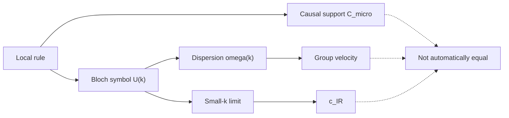

# 0. The physical question

A local quantum lattice has a simple limitation: in one step it can interact
only with its neighbours. This draws a microscopic causal cone.

The project's more precise question is:

> When a local dynamics is observed at large scales, is the speed in the
> emergent relativistic equation determined by the lattice's causal cone?

There are several speeds that must not be conflated:

| Symbol | Question |
|---|---|
| `C_micro` | Which displacements are possible in one step? |
| `V_causal^max` | What is the greatest directional support of the microscopic cone? |
| `V_grp^max` | What is the greatest group velocity of the dispersion? |
| `c_IR` | Which speed appears in the low-energy relativistic limit? |

In one dimension these quantities can look very similar. In several dimensions,
`C_micro` is a convex body, and one number can hide anisotropies.

## Why the question is difficult

A lattice can have diagonal displacements and a highly isotropic low-momentum
Weyl equation while retaining a different finite-momentum dispersion. It can
also contain several nodes or species that respond differently to a deformation.

For this reason the project always freezes the lattice, cell, species, nodes,
units, controls, perturbative order, and PASS/FAIL criterion.
