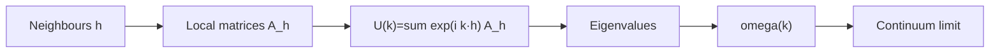

# 1. QCA, quantum walks, and causal cones

## QCA in one sentence

A QCA is a unitary, local evolution of many discrete quantum systems.
“Unitary” means reversible and norm-preserving; “local” means that the update
does not connect arbitrary distant points.

A quantum walk is the linear sector of this kind of dynamics for a particle or
free field. Schematically,

```text
psi(t+1) = sum_h A_h psi(x-h,t),
```

where `h` ranges over allowed displacements and `A_h` acts on an internal
space, the coin.

## The coin is not automatically a spatial dimension

The coin can encode spin, chirality, or other internal degrees of freedom.
Having two components does not mean having two spatial dimensions. Spatial
dimension is determined by the displacement set and the structure of the group
or lattice.

## From the rule to the symbol

If the rule is homogeneous, a Fourier transform turns displacements into
phases:

```text
U(k) = sum_h exp(i k·h) A_h.
```

Local properties become algebraic conditions on `U(k)`. Its eigenvalues give
phases and, after selecting a branch, a dispersion `omega(k)`.



## Thought exercise

In a 1D lattice with two internal states, imagine that `R` moves right and `L`
moves left. Without mixing, the particle separates into two trajectories. A
local mixing between `R` and `L` can produce dispersive dynamics resembling
Dirac dynamics in the continuum limit.

The mixing does not create a metric by itself: it only changes the internal
rule. To call a deformation “geometric,” one must specify which observable
changes and how it is distinguished from a phase, a frame rotation, or a gauge.
