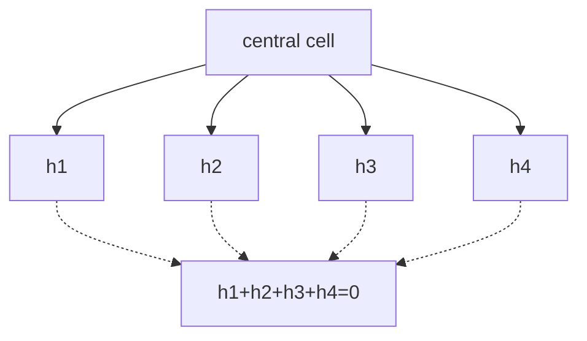

# 2. Example: Weyl on a BCC lattice

This example explains why BCC appears so often in the atlas. It is not a new
derivation: it summarizes the documented background in F12, F14, F15, F16, and
F17.

## The lattice

In three dimensions, four diagonal displacements can be chosen whose sum is
zero. Their neighbours form the body-centred cubic (BCC) geometry.



The lattice is not yet a relativistic metric. It is the support of a
microscopic rule.

## The rule and the limit

A two-component Weyl rule combines the four displacements with matrices `A_h`.
In Fourier space this gives a symbol `U(k)`. Near a low-energy node, the
expansion can have the form

```text
U(k) = I - i (sigma_x k_x + sigma_y k_y + sigma_z k_z) + O(|k|^2).
```

The linear term recalls the Weyl Hamiltonian. The `O(|k|^2)` term remains
important for finite-momentum physics.

## What it shows and what it does not show

It shows:

- that a local rule can produce a low-energy Weyl equation;
- that isotropy, support, and internal representation strongly restrict the
  possible rules;
- that dispersion can depart from relativistic behaviour outside the
  low-momentum regime.

It does not automatically show:

- a variable metric;
- a theory of gravity;
- an identical response of four species to geometric controls;
- an absolute physical scale equal to `c`.

That gap is precisely what separates the documented families from the
project's own gates.
