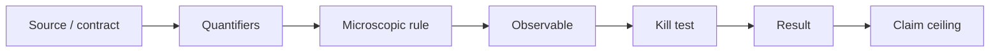

# 3. How to read a family in the atlas

Every card follows the same path. This uniformity allows comparison between
models that use similar words.

## 1. Identity

Which paper, rule, or contract are we reading? Is it a project family, a
successor, or merely an antecedent?

## 2. Quantifiers

Locate the spatial dimension, internal dimension, cell, support, species, nodes,
units, and allowed equivalences. A result for `s=2` does not automatically
become a result for four species.

## 3. Microscopic rule

Ask what actually evolves:

- a unitary tick?
- a continuous Hamiltonian?
- a substep circuit?
- a statistical model or an effective theory?

Two papers can produce similar equations with incompatible microscopic rules.

## 4. Geometric observable

Which object is being called geometry? It may be causal support, an embedding, a
principal frame, a metric, a gauge variable, or a constraint. The name is not
enough; there must be an operational definition.

## 5. Kill test

The kill test is the fastest way to learn what cannot be claimed. For example,
F3 fails because of an orientation ambiguity before the species test is run; F5
excludes only a restricted factorization; F13 shows that rotational symmetry
does not imply Lorentz symmetry.

## 6. Claim ceiling

At the end of every card it should be possible to complete:

> This result supports the claim ___, under ___; it does not support the claim
> ___ .

