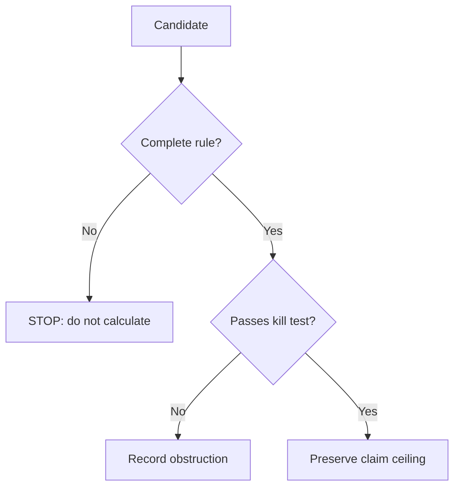

# 5. Failures and obstructions

A scientific atlas should not show only the models that survive. Failures are
useful because they reveal which assumption was missing.

## F1: insufficient rank

In the W6/CJWW class, W12 finds a three-dimensional universal subfamily, but
the constant metric response has rank `3/6`. This is a negative result for that
control class, not a claim that no QCA can have gravity.

## F3: orientation is undefined

The unitary hopping attempt depends on choosing an orientation of the
half-support. If two choices produce different generators, the model is not
well-defined before the species test.

## F5: a no-go with narrow quantifiers

The certificate excludes a three-factor factorization, one factor per
coordinate, in the original cell and one tick. Changing the cell, grouping
steps, or adding ancillas would be a different problem, not a refutation of
the certificate.

## F7: the rule is missing

A dynamic-graph architecture may be interesting, but without a complete rule
`U(g)` and a geometric observable there is no symbol to calculate.

## F13: rotation is not enough

A theory can have rotational symmetry and still not be Lorentzian. The internal
space dimension and the Hamiltonian's form matter.

## Rule to remember

A failure is not fixed by retrospectively changing the contract. Record it,
preserve its scope, and open a new case if the new rule is physically motivated
and genuinely distinct.

