# Atlas de familias geométricas para QCA/QW

> Copia publicada del atlas canónico de `qca-causal-cones` (commit `0a4606c`). Las referencias a informes, teoría, scripts, debates y estado del repositorio de investigación, que es privado, aparecen como texto sin enlace.

Primera edición documental: 2026-09-30. Base inspeccionada:
`research/gravitational-normalization-gate` @ `16850476a6320c55aaf6d25471d00454cdc15b41`.
Sincronización posterior: se recuperaron los expedientes remotos F2-F5 hasta
`3976026`, el atlas inicial se publicó en `f21af94`, y esta versión añade el
certificado restringido F5 y la selección/preflight F7.

El atlas registra clases, contratos, obstrucciones y puentes. No decide gates:
manda CURRENT_STATE. No es una clasificación
exhaustiva, una afirmación de novedad ni una autorización para abrir modelos.
Los IDs F son del atlas; no sustituyen los IDs W del proyecto.

La capa de relaciones tipadas está en [RELATIONS.md](RELATIONS.md), con su
versión estructurada en [relations.csv](relations.csv). Las relaciones no
abren gates ni transfieren automáticamente cuantificadores.

La aplicación al proyecto está resumida en
PROJECT_NAVIGATION.md; es una guía de selección y
claim ceiling, no un contrato nuevo.

La [edición para estudiantes](../README.md) explica los mismos
límites con ejemplos y diagramas, sin sustituir esta edición canónica.

## Registro maestro

| ID / ficha | Clase y objeto geométrico | Resultado trazable en esta edición | Evidencia / decisión |
|---|---|---|---|
| [F1 — W6 Pauli-selective](families/F1_w6_pauli_selective.md) | Grafo fijo; nueve controles de transporte; métrica del símbolo principal | `UNIVERSAL_SUBFAMILY_DEFICIENT`: rango 3/6 sobre métricas constantes | Revisión W12 registrada; `CLOSED_BY_CONTRACT` para W6/CJWW |
| [F2 — Embedding común](families/F2_common_embedding.md) | Embedding afín común; métrica cinemática constante | `KINEMATIC_COMMON_EMBEDDING_UNIVERSAL / ELASTIC_HOPPING_RESPONSE_OPEN` | Certificado simbólico recuperado; preliminar, revisión independiente pendiente |
| [F3 — Hopping unitario elástico](families/F3_unitary_elastic.md) | Hopping con orientación de semisoporte | `UNITARY_ELASTIC_RESPONSE_INCONSISTENT` | Contraejemplo exacto de orientación; test de especies no ejecutado |
| [F4 — Hopping hermítico elástico](families/F4_hermitian_elastic.md) | Respuesta hermítica de hopping más embedding común | `HERMITIAN_ELASTIC_METRIC_UNIVERSAL_EMBEDDING_ONLY` | Certificado recuperado; hopping no aporta marco métrico nuevo a primer orden |
| [F5 — Puente paired-QW](families/F5_arrighi_facchini_bridge.md) | Antecedente publicado de QWs curvos mediante substeps direccionales | `SINGLE_COORDINATE_FACTORIZATION_EXCLUDED` para el puente restringido | Certificado autor-side nuevo; no-go solo para un factor por coordenada en celda C2 |
| [F6 — Arnault-Debbasch](families/F6_arnault_debbasch.md) | DTQW curvo publicado en (1+2)D | `PUBLISHED_2D_CURVED_DTQW / DIRECT_3D_CJWW_BRIDGE_NOT_PROVIDED` | Comparador bibliográfico; sin test algebraico |
| [F7 — QCGD](families/F7_qcgd.md) | Grafos cuánticos dinámicos; causalidad intrínseca | `NO_RULE_SPECIFIED` tras preflight `BRIDGE_QUANTIFIERS_OPEN` | Contrato de especificación congelado; no hay test métrico ejecutable |
| [F8 — Gu-Wen constraints](families/F8_gu_wen_constraints.md) | Sector tensorial con constraints escalares/vectoriales y helicidad +/-2 | `VACUUM_CONSTRAINT_ARCHITECTURE_PRIOR_ART / DIRECT_CJWW_SOURCE_BRIDGE_OPEN` | Fuente primaria y W10 reparado; no hay puente CJWW local |
| [F9 — Pretko tensor gauge](families/F9_pretko_tensor_gauge.md) | Teorías gauge tensoriales rank-2; Gauss laws, fractones y polarizaciones | `RANK2_GAUSS_LAW_PRIOR_ART / DIRECT_CJWW_QCA_BRIDGE_ABSENT` | Fuente primaria; diccionario estructural, no familia CJWW ejecutable |
| [F10 — Gauge-invariant CA](families/F10_gauge_invariant_ca.md) | Autómatas celulares con extensión gauge local; variables de enlace y sourcing matter/gauge | `GAUGE_EXTENSION_CA_ARCHITECTURE_PRIOR_ART / DIRECT_CJWW_QCA_BRIDGE_ABSENT` | Fuente primaria arXiv; arquitectura gauge discreta, no geometría CJWW |
| [F11 — Arnault–Cedzich lattice gauge](families/F11_arnault_cedzich_lattice_gauge.md) | Acción de walk (1+1)D, corriente de carga U(1) y sourcing gauge clásico | `DISCRETE_TIME_U1_ACTION_CURRENT_PRIOR_ART / DIRECT_CJWW_GEOMETRY_BRIDGE_ABSENT` | Lectura primaria acotada; campos no cuantizados, sin materia CJWW 3D ni test métrico |
| [F12 — QCA de la luz](families/F12_bisio_dariano_perinotti_light.md) | Weyl QCA 3D en red BCC; bilineales Maxwell y dispersión de fotón compuesto | `PUBLISHED_3D_WEYL_QCA_MAXWELL_PRIOR_ART / DIRECT_CJWW_METRIC_BRIDGE_ABSENT` | Fuente primaria; marco fijo, sin métrica variable ni test de especies |
| [F13 — Farrelly–Short](families/F13_farrelly_short_discrete_spacetime.md) | Partícula causal discreta con espacio interno finito; límite Weyl y contraejemplo interno-3 | `PUBLISHED_CAUSAL_SINGLE_PARTICLE_WALK_PRIOR_ART / DIRECT_CJWW_METRIC_BRIDGE_ABSENT` | Fuente primaria; rotacional no implica Lorentz, sin puente métrico CJWW |
| [F14 — Walks isotrópicos](families/F14_isotropic_qw_classification.md) | Clasificación de walks de Cayley isotrópicos con coin 2; unicidad BCC y dos Weyl en d=3 | `PUBLISHED_ISOTROPIC_CAYLEY_QW_CLASSIFICATION / DIRECT_CJWW_METRIC_BRIDGE_ABSENT` | Fuente primaria; clasificación estructural, sin métrica variable ni test de especies |
| [F15 — Principios informacionales](families/F15_information_principles_dirac.md) | QCA Weyl/Dirac derivada de linealidad, localidad, homogeneidad e isotropía | `INFORMATION_AXIOM_DERIVED_WEYL_DIRAC_QCA_PRIOR_ART / DIRECT_CJWW_METRIC_BRIDGE_ABSENT` | Fuente primaria; arquitectura BCC y acoplamiento Weyl–Dirac, sin puente métrico |
| [F16 — Białynicki-Birula](families/F16_bialynicki_birula_qca.md) | QCA cúbica/BCC explícita para Weyl y Dirac | `PUBLISHED_CUBIC_QCA_WEYL_DIRAC_PRIOR_ART / DIRECT_CJWW_METRIC_BRIDGE_ABSENT` | Regla local primaria; sin métrica variable ni respuesta CJWW |
| [F17 — Lorentz no lineal](families/F17_weyl_walk_lorentz.md) | Simetría no lineal del Weyl walk en espacio de momentos | `NONLINEAR_POINCARE_SYMMETRY_PRIOR_ART / DIRECT_CJWW_METRIC_BRIDGE_ABSENT` | Simetría deformada a momento finito; sin métrica dinámica |
| [F18 — Gravedad fractónica](families/F18_fracton_emergent_gravity.md) | Fractones, gauge rank-2 y gravitón emergente | `FRACTON_TENSOR_GRAVITY_PRIOR_ART / DIRECT_CJWW_QCA_BRIDGE_ABSENT` | Mecanismo de movilidad restringida; no QCA CJWW |
| [F19 — Gauge emergente](families/F19_emergent_gauge_gravity_mechanism.md) | Emergencia efectiva de gauge y difeomorfismos lineales | `EFFECTIVE_GAUGE_EMERGENCE_PRIOR_ART / DIRECT_CJWW_QCA_BRIDGE_ABSENT` | Marco efectivo; sin regla microscópica CJWW |
| [F20 — Bose–Lifshitz](families/F20_lifshitz_bose_liquid.md) | Líquido de Bose algebraico y gravedad de Lifshitz en red FCC | `LATTICE_BOSE_LIQUID_LIFSHITZ_GRAVITY_PRIOR_ART / DIRECT_CJWW_QCA_BRIDGE_ABSENT` | Fase IR gauge/gravitatoria; red rígida, sin puente CJWW |

## Mapa de navegación

Las aristas clasifican entradas; no representan implicaciones ni equivalencias.
El color expresa el estado documental de esta edición, no viabilidad física.
Rojo: cierre contractual o fallo terminal; gris: no ejecutado; azul:
antecedente bibliográfico; amarillo: cuestión abierta; verde: test acotado
superado, sin promoción a programa completo.

```mermaid
flowchart TB
  A["Atlas QCA/QW"] --> G["Grafo fijo / controles"]
  A --> P["Walks curvos publicados"]
  A --> D["Grafos dinámicos"]
  A --> C["Sectores con restricciones"]
  A --> L["Arquitecturas gauge / links"]
  G --> F1["F1 · W6/CJWW · cierre contractual"]
  G --> F2["F2 · embedding común · cinemática PASS"]
  G --> F3["F3 · hopping unitario · inconsistente"]
  G --> F4["F4 · hopping hermítico · embedding only"]
  P --> F5["F5 · paired-QW · puente restringido excluido"]
  P --> F6["F6 · Arnault-Debbasch · comparador 2D"]
  D --> F7["F7 · QCGD · NO_RULE_SPECIFIED"]
  C --> F8["F8 · Gu-Wen · constraint prior art"]
  C --> F9["F9 · Pretko · rank-2 gauge prior art"]
  L --> F10["F10 · gauge-invariant CA · link variables"]
  L --> F11["F11 · acción de walk · corriente U(1)"]
  A --> F12["F12 · Weyl QCA · Maxwell compuesto"]
  A --> F13["F13 · partícula causal · Weyl / no Lorentz"]
  A --> F14["F14 · isotropía Cayley · BCC / Weyl"]
  A --> F15["F15 · principios informacionales · Weyl / Dirac"]
  A --> F16["F16 · Białynicki-Birula · QCA Weyl/Dirac"]
  A --> F17["F17 · Lorentz no lineal · Weyl walk"]
  A --> F18["F18 · fractones · gravedad rank-2"]
  A --> F19["F19 · gauge emergente · gravedad lineal"]
  A --> F20["F20 · Bose líquido · Lifshitz"]
  classDef closed fill:#fee2e2,stroke:#991b1b,color:#111827;
  classDef pending fill:#e5e7eb,stroke:#4b5563,color:#111827;
  classDef bibliography fill:#dbeafe,stroke:#1e40af,color:#111827;
  classDef open fill:#fef3c7,stroke:#92400e,color:#111827;
  classDef pass fill:#dcfce7,stroke:#166534,color:#111827;
  class F1,F3,F5 closed;
  class F2 pass;
  class F4,F7 open;
  class F6,F8,F9,F10,F11,F12,F13,F14,F15,F16,F17,F18,F19,F20 bibliography;
```

La secuencia W1–W11 puede incorporarse mediante nuevas fichas o antecedentes
de F1; este núcleo no la inventaría por completo.

## Reglas de incorporación

Objetivo operativo para la versión 1: unas 16 familias. El rango razonable
del atlas es 15-20 familias; por encima de 25-30 sólo se justifica si las
entradas aportan obstrucciones o puentes realmente distintos.

1. Registrar también las familias descartadas. Un resultado breve merece
   entrada si su clase y evidencia pueden identificarse.
2. Usar la plantilla. Conservar por separado resultado
   matemático, nivel de evidencia, revisión y decisión canónica.
3. Congelar clase, soporte, especies, coordenadas, equivalencias y test antes
   de calcular. Si faltan, escribir «no localizado»; el atlas no los reconstruye.
4. Vincular contrato, código permanente, informe, revisión y commits. Para
   bibliografía, citar PDF y página leída. Texto generado no sustituye evidencia.
5. Un cambio de cuantificadores o de regla requiere expediente propio y relación
   explícita con su antecedente. No borrar el fallo ni rescatarlo a posteriori.
6. Mantener el mismo flujo visual por ficha: control → símbolo → términos
   no métricos → marco → métrica → test. Usar pasos pendientes cuando falte evidencia.
7. Los diagramas Mermaid son fuente editable permanente dentro de las fichas.
   Si se exportan figuras, conservar el generador y su correspondencia con la ficha.

Una entrada nueva debe cambiar al menos una de estas cosas: qué cuenta como
geometría, qué regla microscópica se permite, qué kill test aplica, qué modo
de fallo queda registrado o qué puente bibliográfico aporta. Si sólo cambia
un coeficiente, una orientación menor o una variante interna sin nuevo test,
debe ir como subcaso dentro de la ficha existente.

## Distinciones de lectura

El atlas separa embedding, métrica efectiva, soporte causal, transporte,
gauge y restricciones. Una rotación de marco que deja una métrica invariante
no acredita por sí sola una simetría gauge microscópica. Tampoco un coin,
un desplazamiento nodal, una fase escalar o una conexión de espín cuentan
automáticamente como deformación métrica: cada familia debe declarar el test
que los separa. No se impone una taxonomía universal antes de definir el modelo.
