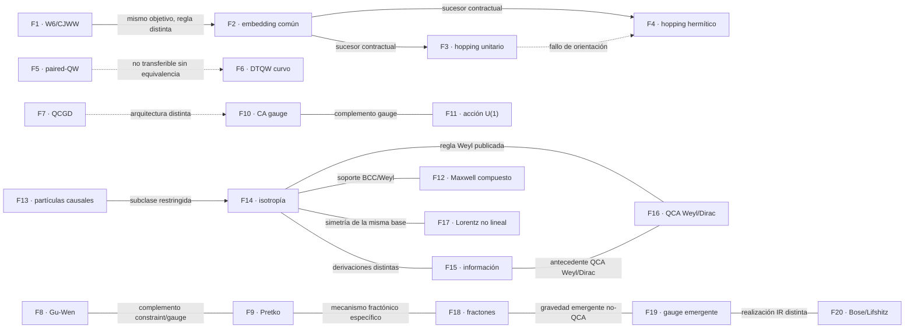

# Relaciones entre familias F1–F20

> Copia publicada del atlas canónico de `qca-causal-cones` (commit `0a4606c`). Las referencias a informes, teoría, scripts, debates y estado del repositorio de investigación, que es privado, aparecen como texto sin enlace.

Fecha: 2026-10-01. Este documento relaciona las fichas existentes; no añade
familias, no modifica sus resultados y no abre ningún gate. La autoridad sobre
el estado científico sigue siendo `state/CURRENT_STATE.md`.

## Semántica de las aristas

| Estado | Significado |
|---|---|
| `ESTABLISHED_FROM_ATLAS` | La relación se sigue directamente de los cuantificadores y resultados escritos en las fichas. |
| `RESTRICTED` | La relación vale solo para el alcance indicado; no se puede generalizar a la familia completa. |
| `ABSENT` | Las fichas no proporcionan el puente necesario. Es una ausencia documentada, no un no-go. |
| `OPEN` | La relación es una pregunta de comparación todavía no comprobada. |

Tipos usados: `subclass`, `same_target_different_rule`, `shared_support`,
`independent_check`, `obstruction_scope`, `architectural_complement`,
`prior_art_bridge` y `contrast`.

## Mapa de alto nivel

Las líneas discontinuas y las etiquetas negativas expresan límites de
transferencia, no implicaciones matemáticas.

## Relaciones principales

### Núcleo W6 y sucesores elásticos

- **F1 → F2 — `same_target_different_rule`, `RESTRICTED`:** ambas preguntan por respuesta métrica común entre especies, pero F1 usa controles Pauli-selective en grafo fijo y F2 un embedding afín común. F2 no rescata ni reabre F1/W12.
- **F2 → F3 — `subclass`, `ESTABLISHED_FROM_ATLAS`:** F3 es un sucesor contractual que añade una regla de hopping dependiente de orientación al embedding común; su fallo es propio.
- **F2 → F4 — `subclass`, `ESTABLISHED_FROM_ATLAS`:** F4 es otro sucesor contractual del embedding común, con parte hermítica de hopping; el resultado métrico queda heredado del embedding.
- **F3 ↔ F4 — `contrast`, `RESTRICTED`:** comparten el antecedente F2, pero no son sustituciones. F3 falla por orientación de la regla unitaria; F4 es una prescripción hermítica distinta.

### Walks curvos y puentes

- **F5 → F6 — `obstruction_scope`, `RESTRICTED`:** el no-go de factorización de F5 solo cubre un tick, celda `C²`, tres factores y una coordenada por factor. La regla agrupada de F6 no queda excluida sin una reducción demostrada.
- **F5 — `prior_art_bridge`, `ABSENT`:** F5 aporta un certificado negativo restringido, no una construcción curva CJWW; por eso esta ausencia no se representa como arista hacia una familia ficticia.

### Grafos, gauge y restricciones

- **F7 → F10 — `contrast`, `RESTRICTED`:** F7 trata grafos cuánticos dinámicos y causalidad intrínseca; F10 trata extensiones gauge con variables de enlace. No hay regla común ni equivalencia.
- **F8 ↔ F9 — `architectural_complement`, `ESTABLISHED_FROM_ATLAS`:** ambos son arquitecturas tensoriales de restricciones/gauge, pero F8 enfatiza helicidad y constraints de Gu–Wen y F9 leyes de Gauss rank-2 y fractones.
- **F9 → F18 — `prior_art_bridge`, `RESTRICTED`:** F18 realiza un mecanismo fractónico-gravitatorio específico dentro del paisaje rank-2, pero no es una implementación QCA de F9 ni hereda automáticamente su alcance.
- **F10 ↔ F11 — `architectural_complement`, `RESTRICTED`:** F10 aporta arquitectura gauge-invariant de CA y F11 una acción/corriente U(1) para un walk en tiempo discreto. Variables gauge clásicas, campos cuantizados y reglas conjuntas no son equivalentes.

### Weyl, BCC y derivaciones relacionadas

- **F13 → F14 — `subclass`, `RESTRICTED`:** F14 fija `s=2`, `G≈Z^d` e isotropía; F13 permite espacio interno finito y evoluciones causales más generales. F14 es una subclase estructural, no una clasificación de toda F13.
- **F14 ↔ F15 — `independent_check`, `RESTRICTED`:** F14 clasifica walks isotrópicos de Cayley; F15 deriva una QCA Weyl/Dirac desde principios informacionales y emergencia del grafo. Se refuerzan como antecedentes relacionados, no como pruebas independientes de una métrica.
- **F14 ↔ F12 — `shared_support`, `RESTRICTED`:** ambas contienen Weyl 3D/BCC; F14 clasifica la regla isotrópica y F12 construye Maxwell compuesto. La primera no implica la construcción Maxwell de la segunda.
- **F14 ↔ F16 — `shared_support`, `RESTRICTED`:** ambas describen una regla Weyl/Dirac en red; F14 aporta clasificación, F16 una regla explícita histórica. No se ha certificado identidad de convenciones ni de operadores.
- **F15 ↔ F16 — `same_target_different_rule`, `RESTRICTED`:** ambas derivan Weyl/Dirac desde QCA locales, pero F15 usa axiomas informacionales y F16 una construcción explícita en red cúbica/BCC.
- **F14 ↔ F17 — `shared_support`, `RESTRICTED`:** F17 analiza simetrías no lineales del Weyl walk BCC y F14 su clasificación isotrópica; no hay transferencia a una métrica espacial dinámica.
- **F12 ↔ F17 — `shared_support`, `RESTRICTED`:** comparten el sector Weyl BCC, pero F12 estudia Maxwell compuesto y F17 el grupo de simetría en espacio de momentos.

### Gravedad emergente fuera de la regla CJWW

- **F8/F9/F18 → F19 — `architectural_complement`, `ABSENT`:** las tres primeras ofrecen arquitecturas tensoriales o fractónicas; F19 ofrece un mecanismo efectivo de emergencia gauge/difeomorfismos. Ninguna ficha contiene el puente microscópico que las identifique.
- **F18 ↔ F20 — `contrast`, `ESTABLISHED_FROM_ATLAS`:** F18 usa movilidad restringida y gauge tensorial rank-2; F20 usa una fase de Bose líquida en red FCC y gravedad de Lifshitz. Son mecanismos IR distintos.
- **F19 ↔ F20 — `contrast`, `RESTRICTED`:** F19 es un mecanismo de teoría efectiva para simetrías gauge; F20 una realización de materia de red con fase IR Lifshitz. No comparten regla microscópica.

## Límites globales

1. Ninguna arista bibliográfica convierte un antecedente en puente CJWW.
2. Ninguna arista entre F1–F4 altera el cierre contractual de W12.
3. `shared_support` no significa igualdad de operadores, de normalización ni de claim ceiling.
4. `subclass` siempre conserva las hipótesis adicionales de la ficha destino.
5. Las relaciones de este documento no sustituyen una revisión primaria ni una comprobación algebraica.

La tabla completa y machine-readable está en [`relations.csv`](relations.csv).
