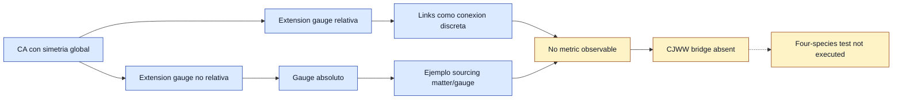

# F10 — Gauge-invariant cellular automata

> Copia publicada del atlas canónico de `qca-causal-cones` (commit `0a4606c`). Las referencias a informes, teoría, scripts, debates y estado del repositorio de investigación, que es privado, aparecen como texto sin enlace.

[Atlas](../FAMILY_BIBLE.md)

## 1. Identidad

Alta documental: 2026-09-30. Familia elegida desde arXiv:
Arrighi, Costes y Eon, *Universal gauge-invariant cellular automata*,
`biblioteca/arXiv-2102.06912.pdf`.

La motivacion es separar una arquitectura local de materia mas variables
gauge/enlace de las familias geometricas. Esta familia es util para no
confundir "gauge field dinamico" con "geometria"; tambien da un lenguaje
preciso para extension gauge, simetria global y sourcing discreto.

## 2. Cuantificadores congelados

Preflight bibliografico, no contrato de calculo. El objeto leido es una
familia de cellular automata clasicos, con alfabeto finito y red regular,
no una QCA unitaria CJWW. No se fija dimension espacial CJWW, no se eligen
especies Weyl, y no se ejecuta test metrico.

El umbral de esta ficha es documental:

- identificar si la fuente aporta una arquitectura gauge local discreta;
- registrar si esa arquitectura es relativa o no relativa;
- separar lo que sirve como antecedente tecnico de lo que no sirve como
  puente a geometria CJWW.

## 3. Qué es geometría en esta familia

Nada se cuenta como geometria CJWW en esta ficha. El objeto operativo son
campos gauge discretos, transformaciones gauge locales y variables de enlace
que comparan elecciones gauge entre vecinos.

En una extension relativa, los valores gauge viven en aristas y transforman
por accion izquierda/derecha de los gauges de los vertices vecinos. Esto se
parece formalmente a una conexion discreta, pero aqui no se declara metrica,
tetrad, embedding, curvatura de grafo ni marco relativista.

## 4. Qué no es geometría

No cuenta como geometria:

- simetria gauge local por si sola;
- color-blindness o simetria global;
- variables de enlace gauge;
- sourcing entre matter y gauge field;
- universalidad computacional de la clase gauge-invariant.

Todo eso puede ser estructura dinamica local valiosa sin constituir
deformacion metrica comun para especies CJWW.

## 5. Regla microscópica

La fuente define CA, simetria global, transformaciones gauge locales y
extensiones gauge. La Definicion 2.7 formula la extension gauge mediante
condicion de simulacion y gauge-invariance. La Definicion 2.8 introduce
la extension relativa con gauge fields en enlaces.

Los teoremas leidos establecen dos rutas:

- para extension relativa con evolucion gauge identidad, un CA admite tal
  extension exactamente cuando es globalmente simetrico;
- todo CA admite una extension gauge no relativa.

La Seccion 6 da un ejemplo reversible en el que materia y gauge field se
influyen de forma inyectiva. Ese ejemplo es importante como antecedente de
sourcing discreto, pero no es una regla CJWW ni una geometria dinamica.

## 6. Kill tests

1. Arquitectura gauge local discreta: PASS.
2. Extension relativa iff simetria global: PASS, por teorema de la fuente.
3. Universalidad de CA gauge-invariant: PASS, en el sentido CA de la fuente.
4. Sourcing matter/gauge en ejemplo reversible: PASS para el ejemplo no
   relativo; OPEN para extension relativa segun la conclusion del paper.
5. QCA unitaria CJWW exacta: FAIL/ABSENT en el material leido.
6. Observable metrico comun para especies CJWW: FAIL/ABSENT.
7. Test de cuatro especies: NOT_EXECUTED.

## 7. Resultado

**`GAUGE_EXTENSION_CA_ARCHITECTURE_PRIOR_ART / DIRECT_CJWW_QCA_BRIDGE_ABSENT`.**

Informe:
`reports/2026-09-30--f10-gauge-invariant-ca-preflight.md`.

F10 queda como arquitectura gauge discreta y techo conceptual: si una futura
familia introduce variables de enlace, debe decir si son gauge, geometria o
ambas, y debe probarlo con observables separados.

## 8. Modo de fallo

Fallo de puente directo. La fuente no proporciona tick CJWW, nodos Weyl,
limite plano CJWW, metric response, tetrad comun, ni source local de un
stress tensor CJWW. Ademas, el ejemplo con feedback matter/gauge pertenece
a la extension no relativa y el propio paper deja abierta la version relativa
con sourcing.

## 9. Qué deja vivo

Deja vivo un vocabulario tecnico para futuras familias con links:

- extension relativa frente a no relativa;
- gauge field en aristas frente a gauge absoluto;
- simetria global como condicion de extension relativa;
- sourcing matter/gauge compatible con reversibilidad en CA.

Tambien deja una advertencia util: un mecanismo gauge local puede ser
perfectamente serio y aun asi no contar como geometria.

## 10. Qué queda prohibido después

No llamar metrica a una variable de enlace gauge sin test independiente. No
usar universalidad CA como evidencia de universalidad geometrica. No promover
un ejemplo clasico a QCA unitaria sin contrato nuevo. No usar F10 para reabrir
W12, F1 o F7 sin una regla microscópica CJWW/QCA escrita antes del cálculo.

## Flujo visual

