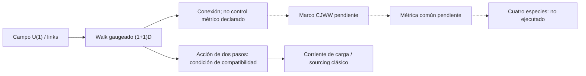

# F11 — Arnault–Cedzich: acción gauge para un walk en tiempo discreto

> Copia publicada del atlas canónico de `qca-causal-cones` (commit `0a4606c`). Las referencias a informes, teoría, scripts, debates y estado del repositorio de investigación, que es privado, aparecen como texto sin enlace.

[Atlas](../FAMILY_BIBLE.md)

## 1. Identidad

Alta documental: 2026-10-01. Preflight de Arnault y Cedzich,
*A single-particle framework for unitary lattice gauge theory in discrete
time*, [arXiv:2208.14997v4](https://arxiv.org/abs/2208.14997v4).
PDF local: `biblioteca/arXiv-2208.14997.pdf`, pp.1-11 y 19-20 leídas.

La motivación bibliográfica precede a cualquier cálculo: localizar una
acción discreta, una corriente local y un acoplamiento gauge para materia
con evolución por quantum walk. F10 trata extensiones de CA clásicos;
F11 trata amplitudes de una partícula y una acción variacional. F11 tampoco
cuantiza los campos ni proporciona una QCA conjunta materia/gauge.

## 2. Cuantificadores congelados

Preflight documental, no contrato de cálculo ni familia CJWW nueva.

| Campo | Alcance leído |
|---|---|
| Espacio y materia | Red (1+1)D; materia spin-1/2 de una partícula; C² basta para las matrices internas (PDF pp.2-3) |
| Regla y soporte | Walk de un paso con saltos −1, 0, +1; acción asociada a una ecuación de dos pasos (pp.4-5) |
| Campos | Amplitud de materia y campo gauge U(1) no cuantizados (p.2) |
| Especies CJWW | No identificadas; cuatro especies +I no sometidas a test |
| Coordenadas | Red fija con paso ε; no embedding ni control métrico variable |
| Fondos | Campo gauge dependiente de espacio y tiempo; condición adicional en la comparación uno/dos pasos (pp.7-8) |
| Dimensión del sector gauge | Acción gauge propuesta en dimensiones generales; sector de materia construido en (1+1)D (pp.8-9) |
| Exactitud y umbral | Identificación de resultados y límites de la fuente; sin certificado algebraico nuevo |

## 3. Qué es geometría

No se identifica una geometría CJWW variable. La fuente usa una red fija y
una estructura de Minkowski en el límite continuo. Los links U(1) y sus
plaquetas describen conexión y campo electromagnético (PDF pp.8-9,
Ecs.64-73), no una deformación del marco principal o de la métrica.

## 4. Qué no se cuenta como geometría

La corriente U(1), la invariancia gauge, una plaqueta electromagnética y las
ecuaciones de Maxwell no acreditan universalidad métrica. La corriente de
Noether es de **carga**: no es un tensor de energía-momento. La conclusión
deja sin abordar las simetrías espaciotemporales y sus teoremas de Noether
(PDF p.11); por tanto no resuelve el stress local CJWW de W11.

## 5. Regla microscópica

La fuente parte de `ψ_(j+1)=W ψ_j` con
`W=W_-1 T_1^-1 + W_+1 T_1 + W_0 I` (PDF p.4, Ecs.18-20).
La especialización de Dirac y las acciones asimétrica/simétrica están en
pp.4-5, Ecs.27-36. La equivalencia con la ecuación de dos pasos requiere
la segunda condición inicial `ψ_1=W ψ_0` (p.4, Ec.19).

El acoplamiento se introduce mediante traslaciones gauge-covariantes. La
Ec.59 da la evolución de un paso gaugeada; la Ec.60 define su walk local
(p.7). La fuente distingue esa ruta del gauging directo de la acción de dos
pasos: las operaciones no conmutan en general. En p.8 declara suficiente
que A₀ sea independiente de la posición; el gauge temporal A₀=0 es una
condición más fuerte. Aquí se registra esa condición como resultado de la
fuente, sin certificar una equivalencia para fondos arbitrarios.

La acción total `S=S_DQW^g+S_G` y su variación producen un campo gauge
clásico con fuente de carga (PDF pp.9-10, Ecs.77-83). No se ha implementado
ni rederivado la regla en este preflight.

## 6. Kill tests

Obligaciones documentales fijadas para esta lectura:

1. Acción discreta ligada a un walk local: LOCALIZED, pp.4-5; conservar
   condición inicial y distinción entre uno y dos pasos.
2. Corriente de carga local: LOCALIZED, p.6, Ecs.43-49; contrastada con la
   segunda derivación desde las EOM del apéndice E, pp.19-20.
3. Gauge dinámico con fuente: LOCALIZED a nivel de campos clásicos, pp.9-10;
   no equivale a un update cuántico unitario conjunto.
4. Materia construida en (3+1)D: NOT_PROVIDED; p.9 lo declara explícitamente.
5. Tick CJWW plano y métrica común: NOT_PROVIDED en el material leído.
6. Test de cuatro especies: NOT_EXECUTED.

Estos rótulos acreditan localización bibliográfica, no un PASS matemático
independiente de las fórmulas de la fuente.

## 7. Resultado

**`DISCRETE_TIME_U1_ACTION_CURRENT_PRIOR_ART / DIRECT_CJWW_GEOMETRY_BRIDGE_ABSENT`.**

Evidencia: lectura primaria acotada; resultados atribuidos al artículo,
sin revisión independiente de esta ficha ni certificado nuevo.
Informe: preflight F11.
Decisión documental: incorporar como antecedente de acción/corriente gauge;
los gates científicos vigentes conservan su alcance.

## 8. Modo de fallo

Ausencia de puente directo en esta fuente, no un no-go: faltan materia CJWW
(3+1)D, recuperación exacta de su tick, observable métrico y comparación de
sus especies. La acción gauge en dimensiones generales no suple la acción
de materia que falta (PDF p.9). La carga U(1) tampoco suple energía-momento.

## 9. Qué deja vivo

Un antecedente para formular acciones y corrientes de carga en tiempo
discreto, y una advertencia sobre la compatibilidad entre acción de dos
pasos y evolución unitaria de un paso. Puede orientar un contrato futuro;
no autoriza extender la regla a CJWW ni abrir backreaction gravitatoria.

## 10. Qué queda prohibido después

No presentar los campos como cuantizados, el sourcing clásico como una
QCA conjunta, Noether interno como conservación de stress, ni el sector
gauge general como materia CJWW 3D. No cambiar dimensionalidad, soporte o
regla para obtener un test favorable sin expediente nuevo. F1/W12 y la
línea cerrada W3–W11 conservan sus decisiones.

## Flujo visual

