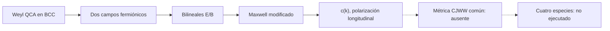

# F12 — Białynicki-Birula/Bisio–D’Ariano–Perinotti: QCA de la luz

> Copia publicada del atlas canónico de `qca-causal-cones` (commit `0a4606c`). Las referencias a informes, teoría, scripts, debates y estado del repositorio de investigación, que es privado, aparecen como texto sin enlace.

[Atlas](../FAMILY_BIBLE.md)

## 1. Identidad

Alta documental: 2026-10-01. Fuente primaria: Bisio, D’Ariano y Perinotti,
*Quantum Cellular Automaton Theory of Light*, `biblioteca/Quantum Cellular
Automaton Theory of Light.pdf`, arXiv:1407.6928v1.

Esta familia es distinta de F5: usa el autómata Weyl isotrópico en una red
BCC y construye operadores bilineales de dos campos fermiónicos para obtener
Maxwell. No es una extensión gauge de CA (F10), ni una acción U(1) de una
partícula (F11), ni un walk curvo por operator splitting (F5).

## 2. Cuantificadores congelados

| Campo | Alcance de la fuente |
|---|---|
| Red y celda | Grupo `G=Z^3`, red BCC, dos componentes Weyl (PDF pp.2-3) |
| Regla | QCA lineal, local, homogéneo, unitario e isotrópico; dos matrices Weyl `A_k^±` (pp.1-3) |
| Campo | Dos campos fermiónicos independientes; el fotón es compuesto (pp.1, 3-5) |
| Sector | Campo libre; no interacción gravitatoria ni deformación métrica espacial |
| Límite | `|k| << 1`, con dispersión relativista aproximada; escala adimensional de Planck (p.3) |
| Observable | Operadores bilineales `E,B` y polarizaciones; no tetrad ni métrica dinámica |
| Test CJWW | No se ejecuta comparación con las cuatro especies del proyecto |

## 3. Qué es geometría

La geometría operacional de esta ficha es la red causal fija (BCC), su
vecindad finita y la dispersión de la regla Weyl. La fuente exige isotropía
como covariancia bajo automorfismos de la vecindad y deriva la regla desde
principios de unitaridad, linealidad, localidad, homogeneidad, transitividad
e isotropía (PDF p.2).

Eso no constituye una métrica variable: la propia conclusión dice que el
modelo está restringido a un marco de referencia fijo y deja para trabajo
futuro la acción del grupo de Poincaré (p.7).

## 4. Qué no se cuenta como geometría

La polarización longitudinal, la composición bosónica, la velocidad de grupo
dependiente de `k` y la dispersión modificada no son por sí solas una métrica
emergente. Tampoco el operador Maxwell bilineal prueba una respuesta común a
controles geométricos ni una dinámica de tetrad.

## 5. Regla microscópica

La evolución local se escribe
`ψ_g(t+1)=Σ_{h∈S} A_h ψ_{hg}(t)` (PDF p.2, Ec.1). Para `G=Z^3` y dos
componentes, la transformación de Fourier da dos automata Weyl con
`A_k^±=d_k^± I+n_k^±·σ=exp(-i n_k^±·σ)` (pp.2-3, Ecs.5-9).

La construcción de Maxwell usa un segundo campo con la matriz conjugada y
operadores bilineales; en el límite de baja densidad sus modos se comportan
aproximadamente como bosones y satisfacen las ecuaciones de Maxwell
modificadas (pp.3-5, Ecs.24-27, 37).

La relación de dispersión es `ω(k)=2|n_k|/2` (p.6, Ec.43). La fuente obtiene
una velocidad dependiente de `k`, anisótropa y con correcciones de signo
opuesto para `A^+` y `A^-` (p.6, Ec.44). Esto es un resultado de la regla
congelada, no evidencia de un cono métrico universal.

## 6. Kill tests

1. QCA local y unitario en red 3D: PASS documental, pp.2-3.
2. Weyl de dos componentes con isotropía BCC: PASS documental, pp.2-3.
3. Maxwell emergente en límite de baja densidad: PASS según la derivación de
   la fuente, pp.3-5; no rederivado aquí.
4. Marco de referencia/Poincaré dinámico: OPEN; la fuente lo deja como futuro,
   p.7.
5. Observable métrico común para especies CJWW: ABSENT.
6. Test de cuatro especies y respuesta a controles: NOT_EXECUTED.

## 7. Resultado

**`PUBLISHED_3D_WEYL_QCA_MAXWELL_PRIOR_ART /
DIRECT_CJWW_METRIC_BRIDGE_ABSENT`.**

Evidencia: lectura primaria acotada, sin revisión independiente de esta ficha
ni certificado algebraico nuevo. Informe: preflight F12.

## 8. Modo de fallo

No es un no-go de la regla Weyl. El límite al programa CJWW falla por alcance:
red BCC y dos componentes fijados, fotón compuesto, marco fijo, sin control
geométrico variable ni stress/source local.

## 9. Qué deja vivo

Deja una regla 3D explícita y un caso de propagación Weyl isotrópica para
comparar dispersión, pero cualquier puente a una métrica o a gravedad exige
un contrato nuevo con observable, cuantificadores y test de especies.

## 10. Qué queda prohibido después

No identificar la red BCC con la geometría física del proyecto, ni convertir
la velocidad `c(k)` en una escala absoluta o en una métrica dinámica. No usar
la construcción Maxwell compuesta para afirmar una QCA conjunta gauge/gravedad
ni reabrir W12.

## Flujo visual

