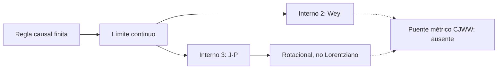

# F13 — Farrelly–Short: partículas causales en espacio-tiempo discreto

> Copia publicada del atlas canónico de `qca-causal-cones` (commit `0a4606c`). Las referencias a informes, teoría, scripts, debates y estado del repositorio de investigación, que es privado, aparecen como texto sin enlace.

[Atlas](../FAMILY_BIBLE.md)

## 1. Identidad

Alta documental: 2026-10-01. Fuente primaria: Farrelly y Short, *Discrete
Spacetime and Relativistic Quantum Particles*, `biblioteca/1312.2852v1.pdf`,
arXiv:1312.2852v1.

La familia estudia walks de una partícula con soporte finito, invariancia
traslacional y un espacio interno finito. Es distinta de F12: no parte de un
QCA Weyl BCC para construir Maxwell, sino que caracteriza el límite continuo
de una clase de evoluciones causales y exhibe el fallo de Lorentz para tres
componentes internas.

## 2. Cuantificadores congelados

| Campo | Alcance de la fuente |
|---|---|
| Espacio y celda | Red `Z^d`, posición discreta y espacio interno finito (p.2) |
| Regla | `U_D = sum_q A_q S_q`, unitaria, translacionalmente invariante y de soporte finito (pp.1-2, Ecs.3-8) |
| Límite | `a, delta t -> 0`, `a/delta t` constante, con corte de bajo momento que crece controladamente (pp.2-3, Ecs.12-16) |
| Caso Weyl | d=3, dimensión interna 2; posible relabelación/rescalado de ejes (pp.3-4, Ecs.17-19) |
| Contraejemplo | d=3, dimensión interna 3; `H = J dot P`, rotacional pero no Lorentziano (pp.4-5, Ecs.22-25) |
| Masa | Término interno `M`; Dirac requiere hipótesis adicionales sobre `M` (p.5, Ecs.26-30) |
| Test CJWW | No ejecutado; no hay cuatro especies ni controles geométricos del proyecto |

## 3. Qué es geometría

La ficha cuenta como estructura geométrica la vecindad finita de los
desplazamientos y el Hamiltoniano principal del límite continuo. La relación
entre `A_q`, los desplazamientos y el marco continuo se atribuye a la fuente;
no se convierte aquí en una métrica dinámica.

## 4. Qué no se cuenta como geometría

La relabelación, el rescalado de ejes, el desplazamiento de velocidad constante
y la elección del espacio interno no prueban por sí solos una métrica común ni
una equivalencia con CJWW. La simetría rotacional del ejemplo de dimensión 3
no implica invariancia de Lorentz: el artículo señala que `H^2-P^2` no es
Lorentz-invariante (p.4).

## 5. Regla microscópica

La regla publicada es la suma finita de operadores de desplazamiento con
coeficientes internos `A_q`. El ejemplo Weyl usa desplazamientos condicionales
por cada eje, `U_D=T_x T_y T_z`, con matrices de Pauli y vecindad BCC (p.4,
Ecs.20-21). El ejemplo de tres componentes usa `T_b=exp(-i a P_b J_b)` y
desplazamientos en los autovectores de `J_b` (p.5, Ecs.23-25).

## 6. Kill tests

1. Evolución causal y de soporte finito: PASS documental, pp.1-2.
2. Límite Weyl para dimensión interna 2: PASS bajo las hipótesis y
   equivalencias declaradas, pp.3-4.
3. Lorentz invariance para dimensión interna 3: FAIL en el ejemplo `J dot P`,
   aunque conserva simetría rotacional, pp.4-5.
4. Puente directo a métrica CJWW y respuesta a controles: ABSENT.
5. Test de las cuatro especies: NOT_EXECUTED.

## 7. Resultado

**`PUBLISHED_CAUSAL_SINGLE_PARTICLE_WALK_PRIOR_ART /
DIRECT_CJWW_METRIC_BRIDGE_ABSENT`.**

Evidencia: lectura primaria acotada; no hay revisión independiente de la
ficha ni certificado algebraico nuevo. Informe: preflight F13.

## 8. Modo de fallo

El contraejemplo interno-3 impide usar simetría rotacional sola como garantía
de límite Lorentziano. El puente al programa CJWW queda ausente porque la
fuente no define controles geométricos, cuatro especies, métrica variable ni
fuentes/backreaction locales.

## 9. Qué deja vivo

Deja una clase publicada para comparar soporte finito, dimensión interna y
límite continuo, además de un kill test claro para separar rotación de
Lorentz. Cualquier uso como sucesor CJWW exige contrato nuevo y motivación
física independiente.

## 10. Qué queda prohibido después

No presentar el teorema Weyl de dimensión interna 2 como una clasificación de
los cuatro nodos CJWW, ni el ejemplo interno-3 como un no-go general de QCA.
No usar la relabelación o el rescalado de coordenadas para afirmar una escala
física absoluta o una métrica dinámica.

## Flujo visual

