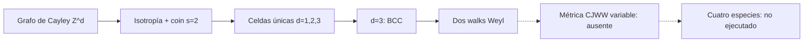

# F14 — Clasificación de walks isotrópicos en retículas

> Copia publicada del atlas canónico de `qca-causal-cones` (commit `0a4606c`). Las referencias a informes, teoría, scripts, debates y estado del repositorio de investigación, que es privado, aparecen como texto sin enlace.

[Atlas](../FAMILY_BIBLE.md)

## 1. Identidad

Alta documental: 2026-10-01. Fuente primaria: D’Ariano, Erba y Perinotti,
*Isotropic quantum walks on lattices and the Weyl equation*,
`biblioteca/1708.00826v2.pdf`, arXiv:1708.00826v2.

La familia clasifica walks isotrópicos con coin de dimensión 2 sobre grafos de
Cayley de `Z^d`, para `d=1,2,3`. Es distinta de F12, que construye Maxwell
compuesto a partir de un QCA Weyl, y de F13, que estudia una clase más general
de partículas causales y su límite continuo.

## 2. Cuantificadores congelados

| Campo | Alcance de la fuente |
|---|---|
| Grupo y espacio | `G ~= Z^d`, `d=1,2,3`; base de posiciones del grafo de Cayley (pp.1-4) |
| Regla | `A = sum_h T_h tensor A_h`, unitaria, local y homogénea (pp.1-3, Ecs.1-9) |
| Coin | Dimensión `s=2` (pp.1, 4) |
| Isotropía | Covariancia bajo automorfismos del grafo y representación proyectiva del coin (pp.1-3, Ec.4) |
| Soportes clasificados | Entera d=1, cuadrada simple d=2 y BCC d=3 (Fig.1, p.6) |
| Resultado 3D | Dos walks Weyl, izquierda y derecha, módulo simetrías discretas (pp.1, 7-8, Proposición 5) |
| Test CJWW | No ejecutado; no hay cuatro especies ni controles geométricos del proyecto |

## 3. Qué es geometría

La geometría operacional de la ficha es el grafo de Cayley, su conjunto de
generadores y la acción de isotropía que permuta direcciones. La Proposición 5
relaciona esa estructura con las celdas primitivas admisibles.

## 4. Qué no se cuenta como geometría

La covariancia de isotropía, el coin de dos componentes y la equivalencia entre
los dos walks Weyl no prueban una métrica variable ni una redundancia gauge
microscópica. La clasificación tampoco fija una escala física absoluta ni una
respuesta a una deformación de la red.

## 5. Regla microscópica

La fuente usa
`A = sum_h T_h tensor A_h`, con `T_h` la representación regular derecha del
grupo y `A_h` las matrices de transición (pp.1-3, Ecs.1 y 5-8). En d=3, la
isotropía admisible tiene coin `U_L={I,i sigma_X,i sigma_Y,i sigma_Z}` y
generadores `S_+={h_1,h_2,h_3,h_4}` con el relator BCC
`h_1+h_2+h_3+h_4=0` (Fig.1, p.6). Las matrices de los dos walks Weyl aparecen
en las Ecs.24-25 (p.7).

## 6. Kill tests

1. Localidad, homogeneidad y unitaridad del walk: PASS bajo las condiciones
   del artículo, pp.1-3.
2. Restricción por isotropía a las celdas primitivas clasificadas: PASS
   documental, Proposición 4 y Fig.1, pp.5-6.
3. Clasificación `s=2`, `d=1,2,3`: PASS documental según la Proposición 5,
   pp.7-8.
4. Puente a métrica CJWW variable y respuesta común de especies: ABSENT.
5. Test de las cuatro especies: NOT_EXECUTED.

## 7. Resultado

**`PUBLISHED_ISOTROPIC_CAYLEY_QW_CLASSIFICATION /
DIRECT_CJWW_METRIC_BRIDGE_ABSENT`.**

Evidencia: lectura primaria acotada; no hay revisión independiente de la
ficha ni certificado algebraico nuevo. Informe: preflight F14.

## 8. Modo de fallo

El límite de transferencia es de alcance: la clasificación fija `s=2` y una
familia isotrópica de grafos de Cayley, pero no define deformaciones métricas,
controles de hopping, cuatro especies CJWW ni backreaction.

## 9. Qué deja vivo

Deja una clasificación estructural para comparar soportes BCC, isotropía y
representaciones Weyl. Una extensión CJWW requeriría congelar por separado la
celda, especies, observable métrico y equivalencias permitidas.

## 10. Qué queda prohibido después

No presentar la Proposición 5 como clasificación de todos los QCA ni de todas
las dimensiones internas. No inferir de la unicidad BCC una ley de métrica
universal, una velocidad física absoluta o una respuesta a deformaciones.

## Flujo visual

