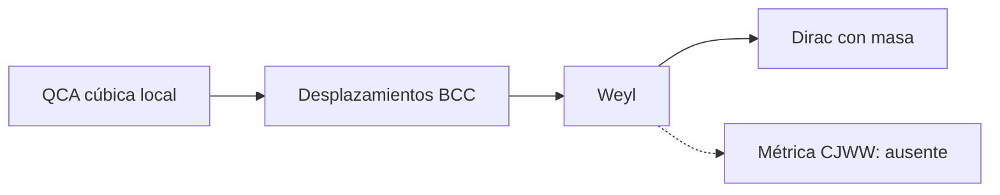

# F16 — Białynicki-Birula: QCA de Weyl y Dirac

> Copia publicada del atlas canónico de `qca-causal-cones` (commit `0a4606c`). Las referencias a informes, teoría, scripts, debates y estado del repositorio de investigación, que es privado, aparecen como texto sin enlace.

[Atlas](../FAMILY_BIBLE.md)

## 1. Identidad

Fuente primaria: Białynicki-Birula, *Dirac and Weyl Equations on a Lattice as Quantum Cellular Automata*, `biblioteca/Dirac and Weyl Equations on a Lattice as Quantum Cellular Automata.pdf`.

## 2. Cuantificadores congelados

| Campo | Alcance |
|---|---|
| Red | Red cúbica y, para el ejemplo 3D, desplazamientos diagonales BCC (pp.1-4) |
| Regla | Evolución local, unitaria y reversible de dos componentes (pp.1-4) |
| Simetría | Valores constantes invariantes y simetría de la red (p.1) |
| Límite | Weyl a baja escala; masa por inversiones de helicidad (pp.4-5) |
| Test CJWW | No ejecutado |

## 3. Resultado

**`PUBLISHED_CUBIC_QCA_WEYL_DIRAC_PRIOR_ART / DIRECT_CJWW_METRIC_BRIDGE_ABSENT`.**

La regla es un antecedente explícito, pero no define una métrica dinámica,
respuesta de especies, stress/source ni backreaction. No se usa como prueba de
universalidad CJWW.

## Flujo visual

