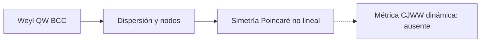

# F17 — Weyl walk y simetría de Lorentz no lineal

> Copia publicada del atlas canónico de `qca-causal-cones` (commit `0a4606c`). Las referencias a informes, teoría, scripts, debates y estado del repositorio de investigación, que es privado, aparecen como texto sin enlace.

[Atlas](../FAMILY_BIBLE.md)

## 1. Identidad

Fuente primaria: Bisio, D’Ariano y Perinotti, *Quantum Walks, Weyl equation and the Lorentz group*, `biblioteca/Quantum Walks, Weyl equation and the Lorentz group.pdf`, arXiv:1707.08455v1.

## 2. Cuantificadores congelados

| Campo | Alcance |
|---|---|
| Walk | Weyl QW local sobre BCC, coin de dimensión 2 (pp.1-3) |
| Nodos | Cuatro regiones de bajo momento, con quiralidades duplicadas (p.3) |
| Observable | Ecuación de autovalores y constantes de movimiento `(omega,k)` (pp.3-7) |
| Simetría | Realización no lineal de Poincaré y dilataciones (pp.1, 7-8) |
| Test CJWW | No ejecutado |

## 3. Resultado

**`NONLINEAR_POINCARE_SYMMETRY_PRIOR_ART / DIRECT_CJWW_METRIC_BRIDGE_ABSENT`.**

La recuperación de Lorentz es una afirmación sobre representaciones en espacio
de momentos: es aproximadamente lineal a bajo `k` y deformada a `k` finito.
No prueba métrica variable, universalidad de especies ni backreaction.

## Flujo visual

