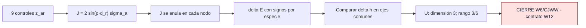

# F1 — Controles W6 Pauli-selective sobre CJWW

> Copia publicada del atlas canónico de `qca-causal-cones` (commit `0a4606c`). Las referencias a informes, teoría, scripts, debates y estado del repositorio de investigación, que es privado, aparecen como texto sin enlace.

[Atlas](../FAMILY_BIBLE.md)

## 1. Identidad

Antecedente W6 y kill test W12, documentados el 2026-09-30; alta en el atlas
en esa fecha. Motivación de W12: comprobar si los controles que completan el
marco en un nodo dan la misma métrica a todas las especies contratadas.
Fuente de la clase: contrato W6.
Fuente del test: contrato W12.

## 2. Cuantificadores congelados

| Campo | Contrato W12 §§0–3 |
|---|---|
| Materia / dimensión | Una partícula libre, dos componentes, CJWW (5.15) en tres dimensiones; `walk2()` |
| Controles | Nueve reales constantes `z_ar`; fondo semiclásico invariante por traslación |
| Direcciones | `d1=(1,0,0)`, `d2=(1,1,0)`, `d3=(1,1,1)`; filas de D |
| Especies decisivas | Cuatro nodos +I: `(0,0,0)`, `(π,π,0)`, `(π,0,π)`, `(0,π,π)` |
| Sector auxiliar | Cuatro nodos −I; no deciden W12 |
| Coordenadas | Ejes de red comunes; sin reflexión ni redefinición espacial por especie |
| Agrupación / ancillas | Sin reemplazar materia, celda, controles ni lattice del contrato; no se introduce supercell |
| Orden | Coeficiente de g, primer orden en momento k; álgebra simbólica exacta |
| Observable | `h=EᵀE`; rangos sobre el coeficiente de g en `δh`, no sobre el valor g=0 |

## 3. Qué es geometría

La métrica espacial del símbolo principal linealizado. Se comparan
`δh_*=E_*ᵀδE_*+δE_*ᵀE_*` en coordenadas comunes. No se identifica con una
métrica dinámica del grafo ni con un campo gravitatorio completo.

## 4. Qué no se cuenta como geometría

Direcciones nulas de la métrica son rotaciones de marco a este orden, sin
que eso pruebe gauge microscópico. En el test no hay desplazamiento nodal:
los símbolos seno de control se anulan en los nodos. El rango 3/6 sobre
perturbaciones constantes no cuenta grados de libertad gravitatorios físicos.

## 5. Regla microscópica

El contrato fija puertas `T_e^(a,r)=exp(-ig Z_ar,e ⊗ J_e^(a,r))` y símbolos
`J^(a,r)(p)=2 sin(p·d_r) σ_a`. La expansión usada en W12 es

`W_g(p)=W_0(p)[I-ig Σ_ar z_ar J^(a,r)(p)]+O(g²)`.

No se trata el truncamiento como una unitaria exacta a g finito.
Con `τ_r=(-1)^(b·d_r)` en `p_*=πb`, el certificado obtiene
`δE_*/g=-2 Z diag(τ_*) D`. El orden inverso del producto coincide a O(gk).

## 6. Kill tests

U1: ocho marcos; U2: respuesta y orden del producto; U3: núcleo de las
diferencias métricas entre las cuatro especies +I; U4: rango métrico en
ese núcleo; U5: rotaciones comunes; U6: recuperación plana por construcción.
El contrato §4 cierra esta línea para rango universal entre 1 y 5 o rango 0.

## 7. Resultado

**`UNIVERSAL_SUBFAMILY_DEFICIENT` — revisión registrada.**

`rank(Φ)=6`, `dim(U)=3`, `U=span{e11,e22,e33}`,
`rank(δh|U)=3/6`, núcleo métrico común nulo.

La revisión
registra DeepSeek ACCEPT y Opus ACCEPT_WITH_REPAIRS. Las reparaciones de
presentación pendientes siguen pendientes: esta ficha no las aplica al certificado.
La cabecera de CURRENT_STATE y el addendum
del informe prevalecen sobre sus párrafos históricos que aún dicen PRELIMINARY.

Decisión: **`CLOSED_BY_CONTRACT` para W6/CJWW**, por instrucción del usuario
registrada en `687ffc3`. No es un no-go general de gravedad emergente.

| Artefacto | Procedencia |
|---|---|
| Contrato | `2ff88b2` |
| Certificado y reporte | Ejecución `5485cb0`; leer addendum posterior |
| Revisión y derivación alternativa | `4b0797d` |
| Reejecución local | Tres scripts completados con salida PASS; registro |

## 8. Modo de fallo

Controles genéricos no universales; subfamilia universal de rango insuficiente
para el umbral contractual sobre métricas constantes. En esa subfamilia:
`δh12=δh22/2`, `δh13=δh33/2`, `δh23=δh33/2`.

La revisión obliga a limitar la interpretación: como condición gauge sobre
`δh_ij=∂i ξj+∂j ξi`, el determinante del símbolo es proporcional a
`-q3(2q1q2-q1q3-q2²)`. Su degeneración está en un plano y un cono; no
corresponde a «tres componentes físicas ausentes». El script de comprobación
reproduce ese determinante. Incluir los ocho nodos da rango universal cero,
pero es un diagnóstico auxiliar, no el contrato que decide W12.

## 9. Qué deja vivo

La fórmula de respuesta por nodo y el test reproducible de universalidad;
cada nodo +I por separado conserva rango métrico 6. Nada de esto reabre
W6/CJWW. Movimiento documental admisible: mantener vinculadas las limitaciones
de revisión a toda cita del negativo.

## 10. Qué queda prohibido después

No rescatar mediante coordenadas por especie, selección nueva de nodos,
ajuste de controles o supercell. Una familia distinta requiere justificación
física independiente previa al cálculo y su propio contrato. W12 no autoriza
un gate conjunto Einstein–Weyl.

## Flujo visual

