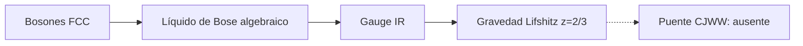

# F20 — Líquido de Bose algebraico y gravedad de Lifshitz

> Copia publicada del atlas canónico de `qca-causal-cones` (commit `0a4606c`). Las referencias a informes, teoría, scripts, debates y estado del repositorio de investigación, que es privado, aparecen como texto sin enlace.

[Atlas](../FAMILY_BIBLE.md)

## 1. Identidad

Fuente primaria: Xu y Hořava, *Emergent Gravity at a Lifshitz Point from a Bose Liquid on the Lattice*, `biblioteca/arXiv-1003.0009.pdf`.

## 2. Cuantificadores congelados

| Campo | Alcance |
|---|---|
| Microscópico | Bosones en red FCC con variables en sitios y caras (pp.1-3) |
| Regla | Hamiltoniano con hopping, repulsión de densidad y términos locales (p.2, Ec.4) |
| Fase | Líquido de Bose algebraico estable (pp.1-3) |
| IR | Gravedad de Lifshitz `z=3`; transición a `z=2` (pp.1-3) |
| Gauge | Emergente en el subespacio de baja energía con restricciones (pp.1-3, 5-8) |
| Test CJWW | No ejecutado |

## 3. Resultado

**`LATTICE_BOSE_LIQUID_LIFSHITZ_GRAVITY_PRIOR_ART / DIRECT_CJWW_QCA_BRIDGE_ABSENT`.**

La red es rígida y la teoría es Hamiltoniana/condensada, no una actualización
QCA de materia CJWW. La identificación IR no prueba universalidad de especies,
stress/source CJWW ni métrica dinámica microscópica.

## Flujo visual

