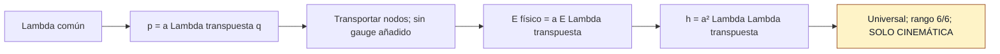

# F2 — Embedding afín común

> Copia publicada del atlas canónico de `qca-causal-cones` (commit `0a4606c`). Las referencias a informes, teoría, scripts, debates y estado del repositorio de investigación, que es privado, aparecen como texto sin enlace.

[Atlas](../FAMILY_BIBLE.md)

## 1. Identidad

Apertura y alta documental: 2026-09-30. El expediente, inicialmente ausente
del checkout, se recuperó del remoto en esta fecha. El
contrato §0
registra motivación de grafo/elasticidad anterior al cálculo y distinta de W6:
una deformación del soporte espacial compartida por toda la materia.

## 2. Cuantificadores congelados

Una partícula, CJWW (5.15), ℓ²(ℤ³)⊗C²; los cuatro nodos +I de W12.
Coordenadas físicas comunes, sin redefinición por especie. `Λ∈GL⁺(3,R)`,
`Λ=I+εL`, L real arbitraria 3×3; a es la escala espacial común. Sin cambio
de celda, especies, ancillas o grouping. Los bloques abstractos W_h y la
unitaria CJWW se conservan. Primer orden en momento de especie; identidad
métrica exacta en Λ. El rango tangente se toma a primer orden en ε.

## 3. Qué es geometría

`X_Λ(n)=aΛn`, `ℓ_h=aΛh`. Con `p=aΛᵀq` y nodo físico
`q_*=a⁻¹Λ⁻ᵀp_*`, el marco es `E_*^(Λ)=aE_*Λᵀ` y la métrica
`h_*^(Λ)=a²ΛΛᵀ`, usando `E_*ᵀE_*=I`.

## 4. Qué no se cuenta como geometría

No se introducen controles Pauli-selective, gauge vectorial/axial ni
respuesta de hopping. La parte antisimétrica de L es rotación rígida
infinitesimal de embedding, sin contenido métrico tangente. Un Λ constante
describe geometría plana y se elimina por un cambio afín global.

## 5. Regla microscópica

`W_Λ(q)=W_0(aΛᵀq)`. Es la misma actualización abstracta en un embedding
distinto; no cambia W_h. A Λ=I recupera exactamente CJWW.
Implementación: certificado permanente.

## 6. Kill tests

E0 recuperación plana; E1 transporte nodal; E2 igualdad métrica entre
especies; E3 rango 6 para strain simétrico, separando rotaciones; E4 techo
cinemático; E5 conservación del negativo W6. Los umbrales están en el contrato.

## 7. Resultado

**`KINEMATIC_COMMON_EMBEDDING_UNIVERSAL / ELASTIC_HOPPING_RESPONSE_OPEN`.**
Identidad exacta `h_*=a²ΛΛᵀ` para las cuatro especies; mapa tangente
`δh/a²=L+Lᵀ`, rango 6/6 y núcleo antisimétrico de dimensión 3.
Certificado reejecutado con código 0. Evidencia canónica **PRELIMINARY /
AUTHOR_DERIVATION / INDEPENDENT_REVIEW_PENDING**; reejecutar no la promueve.

Contrato `25d8138`, código `103a2c4`,
informe
en `b16e15e`, registro de resultado `8d52415`.

## 8. Modo de fallo

No falla E2 ni E3. La limitación es que toda la respuesta es cinemática:
no se construye hopping sensible a strain, curvatura ni dinámica geométrica.

## 9. Qué deja vivo

Referencia universal de embedding y un test para separar esa contribución
de una futura respuesta física. F3 y F4 son sucesores distintos, con contratos
propios; sus terminales no invalidan esta identidad.

## 10. Qué queda prohibido después

El contrato §6 impone detenerse en este terminal. Una nueva regla de hopping
o grafo dinámico requiere motivación previa, contrato propio y repetición del
test de cuatro especies. No se reejecuta W3–W11 por este PASS cinemático.

## Flujo visual

