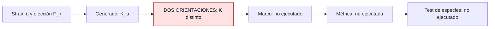

# F3 — Ansatz unitario de hopping elástico con semisoporte

> Copia publicada del atlas canónico de `qca-causal-cones` (commit `0a4606c`). Las referencias a informes, teoría, scripts, debates y estado del repositorio de investigación, que es privado, aparecen como texto sin enlace.

[Atlas](../FAMILY_BIBLE.md)

## 1. Identidad

Apertura y alta documental: 2026-09-30; sucesor de F2. El
contrato congela
la respuesta longitudinal de enlace `ρ_h=(hᵀuh)/(hᵀh)` como motivación
elástica, sin importar un Hamiltoniano de semimetal a CJWW.
Expediente recuperado del remoto después de la primera edición del atlas.

## 2. Cuantificadores congelados

CJWW (5.15), una partícula, ℤ³, celda C², soporte plano de 14 hops;
cuatro especies +I y coordenadas comunes. Strain real simétrico u compartido;
`p=a(I+εu)ᵀq`. F_+ debe contener un representante de cada par ±h y
su elección debe ser físicamente irrelevante. Orden de puertas y coeficiente
fijos; sin nuevas especies, supercell, ancillas ni ajustes tras ejecutar.
La respuesta métrica pretendida era de primer orden, pero no se llegó a ella.

## 3. Qué es geometría

El embedding común y la posible respuesta principal inducida por strain.
La orientación arbitraria de un enlace no forma parte de la geometría física
definida por este contrato.

## 4. Qué no se cuenta como geometría

Desplazamiento nodal por término Pauli constante: gauge vectorial/axial.
Término identidad: fase/quasienergía. Ninguno llegó a extraerse: el test
terminó antes de la comparación entre especies.

## 5. Regla microscópica

`K_u(p)=Σ_(h∈F_+) ρ_h [exp(ip·h)W_h+exp(-ip·h)W_h†]`.
La respuesta congelada es `exp(-iεK_u(p))W_0(p)`, con el embedding anterior.
Es un ansatz de evolución unitaria con generador de rango finito; el
exponencial no acredita soporte estricto de un tick igual al soporte plano.

## 6. Kill tests

Antes de extraer nodos/métrica, comprobar independencia de F_+.
El certificado
extrae exactamente los 14 bloques y compara dos elecciones admisibles con
u=I y p=0: primer componente h1 positivo o negativo.

## 7. Resultado

**`UNITARY_ELASTIC_RESPONSE_INCONSISTENT`.**
`K_+(0)=[[1,1],[1,1]]` y `K_-(0)=[[1,-1],[-1,1]]`.
En los 14 bloques, `W_-h≠W_h†`. El certificado reejecutado reproduce el
contraejemplo, código 0. **Test métrico de cuatro especies NOT_EXECUTED**.
Evidencia: obstrucción algebraica local, sin revisión independiente registrada.

Contrato `15bc76b`, código `f08b884`,
informe
`40e4a16`, registro terminal `ecdbd68`.

## 8. Modo de fallo

La regla depende de una convención que pretendía eliminar. Falla la
definición física de esta respuesta, no la universalidad métrica ni toda
la clase de hopping unitario.

## 9. Qué deja vivo

La identidad de embedding F2 y un testigo exacto reutilizable de orientación.
F4 fue congelada después como otro expediente; no sustituye la regla de F3.

## 10. Qué queda prohibido después

No fijar una orientación favorecida como rescate, cambiar el funcional o
calcular una regla reparada bajo el mismo contrato. No etiquetar este fallo
como no-go universal de hopping ni como fallo métrico de cuatro especies.

## Flujo visual

