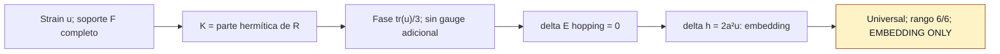

# F4 — Respuesta de hopping elástico hermítico de soporte completo

> Copia publicada del atlas canónico de `qca-causal-cones` (commit `0a4606c`). Las referencias a informes, teoría, scripts, debates y estado del repositorio de investigación, que es privado, aparecen como texto sin enlace.

[Atlas](../FAMILY_BIBLE.md)

## 1. Identidad

Apertura y alta documental: 2026-09-30. Sucesor separado de F3, congelado
antes de su cálculo de especies para eliminar F_+. Fuente de definición:
contrato.
Expediente recuperado del remoto después de la primera edición del atlas.

## 2. Cuantificadores congelados

Una partícula CJWW (5.15), ℤ³, celda C²; sus 14 bloques W_h completos.
Cuatro nodos +I, coordenadas comunes, u real simétrica de seis componentes,
`p=a(I+εu)ᵀq`. Primer orden en ε y momento de especie; sin cambiar
agrupación, especies, ancillas, orden de puertas ni coeficiente. No se
certifica alcance finito del tick exponencial a ε no nulo; sí del generador.

## 3. Qué es geometría

`h_*=E_*ᵀE_*` en coordenadas físicas comunes, separando contribución de
embedding y respuesta de hopping. El rango 6 puede proceder entero del embedding.

## 4. Qué no se cuenta como geometría

Fase identidad en el nodo, gauge por desplazamiento Pauli constante y tilt
identidad lineal en momento deben separarse del marco. En el cálculo retenido
solo aparece una fase nodal común `α_*=tr(u)/3`.
El desplazamiento **adicional del hopping** es cero; el transporte del nodo
por el embedding sigue el de F2.

## 5. Regla microscópica

`R_u(p)=Σ_(h∈F) ρ_h(u)exp(ip·h)W_h`, con
`ρ_h=(hᵀuh)/(hᵀh)` y `K_u=(R_u+R_u†)/2`.
Se fija `W_(ε,u)(q)=exp(-iεK_u(p))W_0(p)`.
K es hermítico, la actualización es exactamente unitaria y recupera W_0
a ε=0. Código permanente.

## 6. Kill tests

HH0 recuperación plana; HH1 orientación/hermiticidad; HH2 unitariedad;
HH3 descomposición de nodo/gauge; HH4 universalidad; HH5 rango 6;
HH6 separar embedding/hopping; HH7 no rescate. La clasificación distingue
un PASS universal debido solo al embedding de una respuesta de hopping no trivial.

## 7. Resultado

**`HERMITIAN_ELASTIC_METRIC_UNIVERSAL_EMBEDDING_ONLY` — PRELIMINARY.**
`K_u(p_*)=tr(u)I/3`; retirando la fase,
`δE_*^hop=0` y no hay tilt a este orden. Las cuatro especies dan
`δh_*=2a²u`, rango 6/6, completamente heredado de F2.
El certificado reejecutado pasa con código 0. Revisión independiente pendiente.

Contrato `1cda245`, código `060c481`,
informe
`5de01a8`, registros `5631620` y `bfa58dd`.

## 8. Modo de fallo

No hay inconsistencia de orientación ni fallo de universalidad. El término
nuevo no deforma el marco principal al orden contratado. Eso no dice que
el operador de hopping sea cero o carezca de otros efectos.

## 9. Qué deja vivo

Una respuesta unitaria definida sin elección de semisoporte, la separación
explícita de fase/métrica y la referencia de embedding común. Ningún resultado
de curvatura, backreaction o gravedad se desprende de este terminal.

## 10. Qué queda prohibido después

Detenerse en el estado 5 del contrato. No sustituir parte hermítica por otra
prescripción, cambiar orden, funcional de enlace, strain o coeficientes tras
ver la cancelación. Una familia nueva necesita motivación independiente previa.

## Flujo visual

