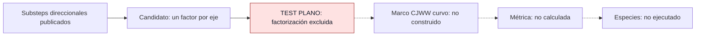

# F5 — Puente al esquema paired-QW de Arrighi–Facchini

> Copia publicada del atlas canónico de `qca-causal-cones` (commit `0a4606c`). Las referencias a informes, teoría, scripts, debates y estado del repositorio de investigación, que es privado, aparecen como texto sin enlace.

[Atlas](../FAMILY_BIBLE.md)

## 1. Identidad

Alta y lectura dirigida: 2026-09-30. La motivación es recuperar un esquema
publicado de métrica/tetrad en vez de inventar una ley elástica para CJWW.
Fuente: `biblioteca/1609.00305v2.pdf`, Arrighi–Facchini. P.1 presenta
el objetivo continuo; p.5 §IV, ec.36, y pp.6–7 muestran los substeps
direccionales, su composición y la implementación. No confundir con
Arrighi–Facchini–Forets (1505.07023), antecedente (1+1)D.

## 2. Cuantificadores congelados

El contrato de verificación
fue escrito antes del nuevo código, pero **después** de la lectura que ya
alegaba el bloqueo. Un tick CJWW (5.15), celda C² original, ejes originales;
tres factores invertibles diferenciables 2×2, uno por coordenada, cualquier
orden. Conjugación constante permitida. Sin supercell, dilación, ancillas,
factores repetidos por eje, mezcla de ejes ni bloqueo temporal.

La fuente admite agrupación/codificación; el certificado no excluye todos
esos puentes. Se aplica solo cuando el candidato en la celda original se
reduce a la factorización anterior. La dimensión física par permite dos
componentes; por sí sola no es el motivo del bloqueo.

## 3. Qué es geometría

En la publicación, parámetros locales cuyo límite continuo implementa
el Hamiltoniano curvo objetivo; la métrica aparece en las matrices del
símbolo principal, no como grafo dinámico. Se comprueba aquí la elegibilidad
del miembro plano exacto, antes de extraer respuesta geométrica CJWW.

## 4. Qué no se cuenta como geometría

Coincidencia de PDE límite no acredita igualdad de un tick. Las matrices
de masa/conexión y la codificación no prueban backreaction o dinámica del
campo métrico. No se ha ejecutado un test de especies en una deformación AF/CJWW.

## 5. Regla microscópica

En el candidato homogéneo de tres substeps, `U=U_i(p_i)U_j(p_j)U_k(p_k)`.
La regla completa AF agrupada se remite al paper; no se identifica con esta
subclase sin verificar sus condiciones de traslación y celda.
Se usa `walk2()` como operador exacto objetivo, sin cambiarlo.

## 6. Kill tests

Si W=A(p_i)B(p_j)C(p_k), su derivada logarítmica izquierda
`L_i=(∂_iW)W⁻¹=A′A⁻¹` depende solo de p_i. El
certificado permanente
da dependencia cruzada para cada posible primer eje y excluye los seis órdenes.
Segunda vía: `W(π/2,p2,p3)=iσ1`, pero a p1=0 W varía en p2 y p3.
Un producto invertible con un factor por eje no puede tener ambas propiedades.
Control positivo: `walk1()` factoriza en el orden 1,2,3 y supera la condición.

## 7. Resultado

**`SINGLE_COORDINATE_FACTORIZATION_EXCLUDED` — PRELIMINARY /
AUTHOR_SIDE_CERTIFICATE / INDEPENDENT_REVIEW_PENDING.**
El código pasa sin tolerancia numérica. El
informe nuevo
delimita el alcance; contrato congelado en `f9dcb46`.
La lectura dirigida
en `3976026` registra `STRUCTURALLY_BLOCKED_IN_STANDARD_OPERATOR_SPLIT`.
Ese literal se conserva con los cuantificadores acotados anteriores, sin
promover todo su contenido a teorema sobre paired QWs.

## 8. Modo de fallo

Factorización del miembro plano en la celda/tiempo original. No es fallo
de la construcción continua de Arrighi–Facchini ni no-go de todos sus usos.

## 9. Qué deja vivo

La plantilla continua publicada y una obstrucción exacta reutilizable para
el puente restringido. Puentes agrupados o circuitos con ejes repetidos
siguen fuera de este test, sin autorización implícita para diseñarlos.

## 10. Qué queda prohibido después

No introducir ancillas, supercell, otro tick o otro walk para evadir este
resultado bajo el mismo contrato. No sustituir exactitud por acuerdo IR sin
una decisión explícita que cambie el objetivo.

## Flujo visual

