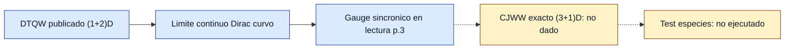

# F6 — Arnault-Debbasch curved DTQW comparator

> Copia publicada del atlas canónico de `qca-causal-cones` (commit `0a4606c`). Las referencias a informes, teoría, scripts, debates y estado del repositorio de investigación, que es privado, aparecen como texto sin enlace.

[Atlas](../FAMILY_BIBLE.md)

## 1. Identidad

Alta documental: 2026-09-30. Familia bibliografica comparadora basada en
`biblioteca/arXiv-1609.00722.pdf`, Arnault-Debbasch, "Quantum walks and
gravitational waves". P.1 declara quantum walks en (1+2)D que admiten un
limite continuo de Dirac en espacio-tiempo curvo.

## 2. Cuantificadores congelados

No se congela una regla CJWW nueva. La lectura solo compara el articulo con
el objetivo del atlas: una particula CJWW (5.15), celda C2, dimension espacial
3, cuatro especies +I y coordenadas comunes. La fuente leida es (1+2)D y no
da aqui una extension unica a (3+1)D.

## 3. Qué es geometría en esta familia

En el articulo, la geometria aparece por parametros angulares de un DTQW cuyo
limite continuo reproduce una ecuacion de Dirac en campo gravitatorio. P.3
escribe las relaciones de tetrada/metrica usadas en esa identificacion; las
componentes temporales quedan en gauge sincronico en la forma leida.

## 4. Qué no es geometría

No se cuenta como geometria CJWW exacta una coincidencia de limite continuo
sin equivalencia de un tick. Tampoco se identifica una onda gravitacional 2D
prescrita con backreaction, dinamica de restricciones o universalidad entre
las cuatro especies CJWW.

## 5. Regla microscópica

P.2, Eq. 2, define un circuito de cuatro subbloques direccionales:

```text
V_j = Pi^-1 W_1(theta_12) W_2(theta_22) Pi
      W_2(theta_21) W_1(theta_11) Q(epsilon(m-T_epsilon/4)).
```

Cada `W_k(theta)` contiene desplazamientos direccionales repetidos. Por eso
el test F5 de "un factor por coordenada" no se aplica a esta regla.

## 6. Kill tests

Kill tests ejecutados en esta edicion: ninguno algebraico. Test documental:
compatibilidad directa con el objetivo CJWW (3+1)D exacto. Resultado: la
fuente leida no proporciona una receta directa de un tick CJWW exacto ni una
extension canonica a dimension espacial 3.

## 7. Resultado

**`PUBLISHED_2D_CURVED_DTQW / DIRECT_3D_CJWW_BRIDGE_NOT_PROVIDED` —
BIBLIOGRAPHIC_COMPARATOR.**

La familia queda viva como comparador de diseno y fuente de advertencias, no
como regla ejecutable para el siguiente calculo del atlas.

## 8. Modo de fallo

Desajuste de objetivo: dimension, regla microscopica y nivel de exactitud.
No es fallo del articulo ni no-go contra extensiones 3D.

## 9. Qué deja vivo

Deja una referencia positiva de DTQW curvo publicado, una forma de separar
parametros de tetrada de otros terminos y una cautela: los circuitos con ejes
repetidos no se reducen al test F5.

## 10. Qué queda prohibido después

No citar F6 como puente CJWW (5.15) exacto sin una extension escrita y
congelada. No aplicar el certificado F5 a F6 sin demostrar que la regla se ha
reducido a un factor por coordenada.

## Flujo visual


