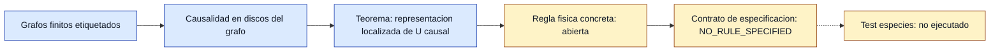

# F7 — Quantum causal graph dynamics

> Copia publicada del atlas canónico de `qca-causal-cones` (commit `0a4606c`). Las referencias a informes, teoría, scripts, debates y estado del repositorio de investigación, que es privado, aparecen como texto sin enlace.

[Atlas](../FAMILY_BIBLE.md)

## 1. Identidad

Alta de seleccion: 2026-09-30. Motivacion heredada del expediente
`reports/2026-09-29--dynamical-geometry-model-class.md`:
buscar geometria como grafo cuantico dinamico, no como control de hopping en
un grafo fijo. Fuente primaria leida: `biblioteca/arXiv-1607.06700v2.pdf`,
Arrighi-Martiel, "Quantum causal graph dynamics".

## 2. Cuantificadores congelados

Preflight, no contrato de calculo. El objetivo externo sigue siendo CJWW
(5.15) exacto en `g=0`, celda C2 sobre Z3, cuatro especies +I y coordenadas
comunes. La lectura F7 pregunta si el marco QCGD da una regla unitaria causal
con puente directo a ese objetivo o si deja cuantificadores abiertos.

No se sustituye Z3 infinito por grafos finitos, toros o limites
termodinamicos sin nuevo contrato.

Tras esta ficha, el contrato de especificacion
`F7_QCGD_CJWW_RULE_SPECIFICATION_GATE`
fija la siguiente puerta: antes de cualquier test metrico, debe existir una
regla `U_F7(g)` completa y una interpretacion geometrica de sus observables.

## 3. Qué es geometría en esta familia

El espacio de estados tiene bases de grafos finitos etiquetados. La geometria
es el propio grafo cuantico, con vecindarios, puertos y etiquetas. La
causalidad se define por discos en el grafo de entrada/salida, no por una
red de fondo fija.

## 4. Qué no es geometría

Una marca auxiliar, una etiqueta local o una descomposicion estructural de una
unitaria ya dada no son por si mismas una metrica CJWW. Tampoco el teorema de
representacion suministra una ley fisica de strain, stress-energy o
backreaction.

## 5. Regla microscópica

La fuente define la clase. P.2, Def. 1, usa subconjuntos finitos de un universo
contable de vertices, grafos no dirigidos de grado acotado, puertos finitos y
etiquetas parciales. P.3, Defs. 6-7, define la base hilbertiana de grafos
finitos etiquetados y la propiedad de conservar vertices.

Pp.5-6 introducen la extension marcada y el teorema: dada una unitaria causal
que conserva vertices, existe una representacion localizada mediante
operadores conmutantes `K_u` en la extension marcada.

## 6. Kill tests

Preflight documental:

1. ¿Cubre directamente Z3 infinito con celda C2? No en las definiciones
   leidas: trabaja con grafos finitos etiquetados.
2. ¿Da una regla CJWW exacta? No: el teorema representa unitarias causales ya
   especificadas, no selecciona una dinamica concreta.
3. ¿Evita el no-go previo de fondo puro con canal reducido exacto? Solo si el
   nuevo contrato permite correcciones o backreaction a `g != 0`; no lo decide
   esta lectura.

## 7. Resultado

**`BRIDGE_QUANTIFIERS_OPEN / EXPLICIT_CJWW_RULE_NOT_SPECIFIED` —
PRIMARY_SOURCE_PREFLIGHT.**

La auditoria de especificacion posterior da
**`NO_RULE_SPECIFIED`**:
`reports/2026-09-30--f7-qcgd-rule-specification.md`.
La arquitectura sigue siendo relevante, pero no hay todavia una familia
ejecutable para el test de cuatro especies.

## 8. Modo de fallo

Fallo de preflight por cuantificadores abiertos: sector finito frente al
objetivo infinito, y ausencia de regla fisica concreta. No es una refutacion
de QCGD ni de extensiones futuras.

## 9. Qué deja vivo

Deja una arquitectura primaria adecuada para pensar grafos dinamicos, una
definicion de causalidad intrinseca al grafo y un criterio claro para el
siguiente movimiento admisible: escribir un contrato que especifique regla,
sector finito/infinito y recuperacion exacta de CJWW en `g=0`.

El contrato ya esta escrito. Lo que falta ahora es el contenido matematico:
sector, background, `U_F7(g)`, observables geometricos y prueba plana.

## 10. Qué queda prohibido después

No inventar un edge flip, un acoplamiento de links o una dinamica de stress
como si viniera del paper. No usar el teorema de representacion como si ya
diera una regla gravitatoria. No hacer el test metrico de especies hasta que
exista una unitaria concreta y congelada.

## Flujo visual

