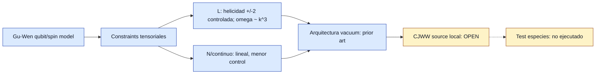

# F8 — Gu-Wen constraint architecture

> Copia publicada del atlas canónico de `qca-causal-cones` (commit `0a4606c`). Las referencias a informes, teoría, scripts, debates y estado del repositorio de investigación, que es privado, aparecen como texto sin enlace.

[Atlas](../FAMILY_BIBLE.md)

## 1. Identidad

Alta documental: 2026-09-30. Familia de restricciones/gauge emergente basada
en Gu-Wen, `biblioteca/arXiv-0907.1203.pdf`, "Emergence of helicity +/- 2
modes (gravitons) from qubit models". La motivacion independiente es usar una
arquitectura publicada de constraints escalares/vectoriales y helicidad +/-2,
no inventar un sector de gravitones para CJWW.

## 2. Cuantificadores congelados

Preflight bibliografico, no contrato de calculo. No se congela una regla
CJWW acoplada. El objetivo externo sigue siendo: materia CJWW exacta en el
limite plano, source local controlado, constraints escalares/vectoriales y
backreaction. Esta ficha solo clasifica que aporta Gu-Wen y donde se detiene.

## 3. Qué es geometría en esta familia

Un campo tensorial simetrico `a_ij` con momento conjugado `E^ij`, restricciones
vectoriales `partial_i E^ij=0` y una restriccion escalar de tipo `R_ii=0`.
En el continuo, estas restricciones generan transformaciones de gauge
linealizadas y dejan dos modos de helicidad +/-2.

En la red de Gu-Wen, las restricciones se implementan mediante variables
compactificadas y penalizaciones de energia en un Hilbert local finito.

## 4. Qué no es geometría

No cuenta como puente CJWW una mera coincidencia de palabras: graviton,
constraint o diffeomorphism. Tampoco se puede fusionar el modelo L controlado
con el modelo N lineal menos controlado. Un sector vacuum de constraints no
es por si mismo acoplamiento a materia CJWW.

## 5. Regla microscópica

La fuente no da una regla CJWW. Da modelos de qubits/spins para un sector
tensorial gravitacional emergente. En p.12-13 coloca las restricciones en una
red cubica con variables compactificadas y penalizaciones de energia.

Los informes W10/W11 del repositorio discuten como un tensor de stress Weyl
podria sourcear constraints Gu-Wen, pero el estado canónico actual mantiene
ese puente abierto tras auditoria.

## 6. Kill tests

1. Separar L y N: PASS.
2. Fuente da sector CJWW exacto: FAIL.
3. Fuente da source local CJWW: FAIL.
4. Arquitectura vacuum de constraints/helicidad +/-2: PASS.
5. Puente sourced CJWW tras W10/W11: OPEN.
6. Novedad de emergent gravitons from qubits: FAIL, es prior art.

## 7. Resultado

**`VACUUM_CONSTRAINT_ARCHITECTURE_PRIOR_ART / DIRECT_CJWW_SOURCE_BRIDGE_OPEN`.**

Informe:
`reports/2026-09-30--f8-gu-wen-constraint-preflight.md`.

El resultado no mata F8. La clasifica como arquitectura de constraints y techo
de novedad, no como familia ejecutable para test metrico CJWW.

## 8. Modo de fallo

Fallo de puente directo: la fuente no contiene materia CJWW ni operadores
locales de stress/energia-momento para el walk. El modelo L controlado no da
dispersion lineal Einstein; el modelo N lineal no tiene control analitico
fiable en la lectura del propio paper.

## 9. Qué deja vivo

Una arquitectura de constraints escalares/vectoriales, un criterio de gauge
emergente de baja energia y un objetivo preciso para un futuro puente:
CJWW matter + Gu-Wen-type constraints + source local + backreaction.

Tambien deja una regla metodologica: una emergencia gauge de baja energia
puede ser suficiente; no hace falta exigir gauge microscopico exacto si se
congela el subespacio efectivo y su Ward identity.

## 10. Qué queda prohibido después

No reclamar novelty por helicidad +/-2 emergente desde qubits. No citar el
modelo L como Einstein linealizado. No citar el modelo N como resultado
controlado. No usar W10 historico como PASS; gana el estado reparado
`OPEN_AFTER_AUDIT`. No ejecutar test de especies hasta definir un acoplamiento
CJWW/constraints completo.

## Flujo visual

