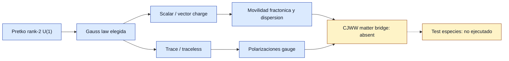

# F9 — Pretko rank-2 tensor gauge family

> Copia publicada del atlas canónico de `qca-causal-cones` (commit `0a4606c`). Las referencias a informes, teoría, scripts, debates y estado del repositorio de investigación, que es privado, aparecen como texto sin enlace.

[Atlas](../FAMILY_BIBLE.md)

## 1. Identidad

Alta documental: 2026-09-30. Familia de teorias gauge tensoriales simetricas
de rango 2, basada principalmente en Pretko,
`biblioteca/arXiv-1606.08857.pdf`, y con apoyo de
`biblioteca/arXiv-1702.07613.pdf` para la lectura "emergent gravity of
fractons". La motivacion es catalogar el lenguaje de Gauss laws,
polarizaciones y movilidad fractonica como arquitectura distinta de Gu-Wen.

## 2. Cuantificadores congelados

Preflight bibliografico, no contrato de calculo. No se elige aun un sector
scalar/vector, trace/traceless, ni una regla QCA. El objetivo externo para
un futuro uso seria acoplar materia CJWW exacta a un sector gauge tensorial,
con source local y backreaction. Esta ficha solo registra que aporta la
familia Pretko y que no aporta.

## 3. Qué es geometría en esta familia

Geometria efectiva como campo gauge tensorial simetrico `A_ij` con conjugado
`E_ij`, Gauss laws de rango 2, constraints de traza opcionales y cargas con
movilidad restringida. En `1702.07613`, el modelo toy
`partial_i partial_j E^ij = rho` se compara con el componente `00` de
Einstein linealizado y con conservacion de centro de masa.

## 4. Qué no es geometría

No es geometria CJWW que exista una Gauss law de rango 2. No se cuenta como
puente a gravedad fisica completa una analogia de fractones si faltan momento,
stress tensor completo, sector Weyl/CJWW y update unitario discreto.

## 5. Regla microscópica

No hay regla CJWW ni QW en las paginas leidas. `1606.08857` es una revision
efectiva/macroscopica de electromagnetismos tensoriales, con modelos de red
remitidos a apendices y trabajos previos. `1702.07613` usa un toy model de
campo tensorial para discutir movilidad y atraccion tipo gravitatoria.

## 6. Kill tests

1. Identidad independiente de Gu-Wen: PASS.
2. Fuente da CJWW/QCA exacto: FAIL.
3. Fuente da Einstein-Weyl acoplado: FAIL.
4. Fuente da Gauss laws rank-2 y conteo de polarizaciones: PASS.
5. Novedad de 5-to-2 tensor-gauge reduction: FAIL, prior art.
6. Familia ejecutable para test metrico CJWW: OPEN/ABSENT.

## 7. Resultado

**`RANK2_GAUSS_LAW_PRIOR_ART / DIRECT_CJWW_QCA_BRIDGE_ABSENT`.**

Informe:
`reports/2026-09-30--f9-pretko-tensor-gauge-preflight.md`.

F9 queda como diccionario estructural y techo de novedad, no como puente
ejecutable.

## 8. Modo de fallo

Fallo de puente directo: no hay materia CJWW, no hay un tick unitario, no hay
source local del walk y no hay recuperacion plana CJWW. La arquitectura ayuda
a formular constraints, pero no suministra el modelo de materia.

## 9. Qué deja vivo

Una lista clara de variantes rank-2: scalar charge, traceless scalar charge,
vector charge y traceless vector charge, con sus diferencias de movilidad,
dispersion y polarizaciones. Tambien deja un vocabulario para un futuro
contrato: elegir Gauss law antes de intentar sourcearla con CJWW.

## 10. Qué queda prohibido después

No llamar "gravedad emergente desde CJWW" a una Gauss law rank-2 aislada.
No presentar el 5-to-2 como novedad. No mezclar linealidad de dispersion,
dos polarizaciones y acoplamiento a materia como si vinieran juntas en una
sola fuente ejecutable. No calcular especies hasta congelar sector y regla.

## Flujo visual

